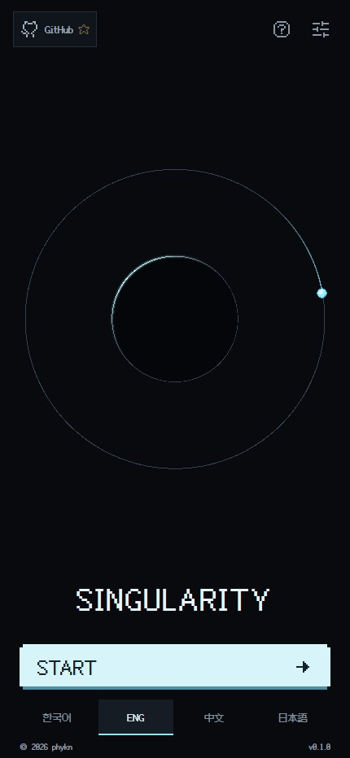
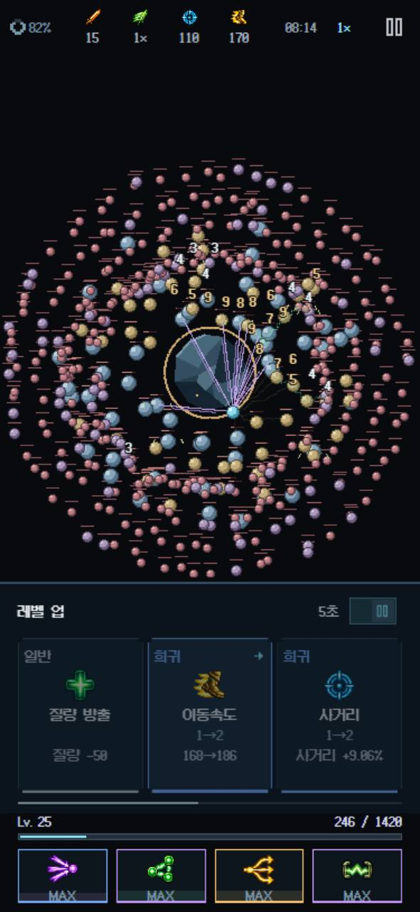
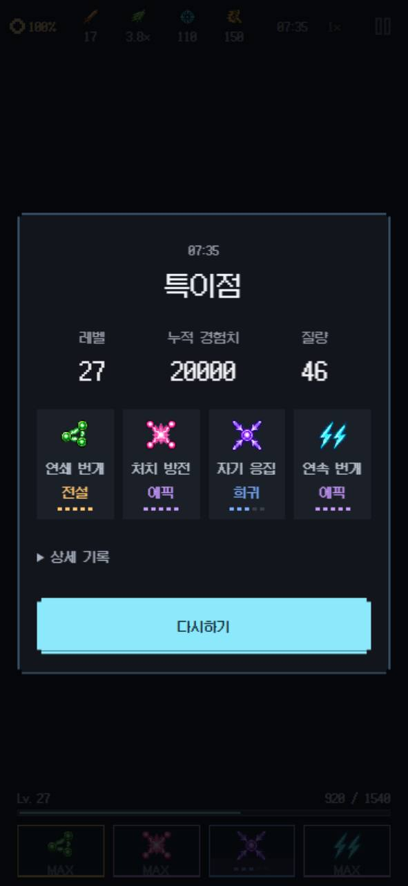

# SINGULARITY

**From a tiny electron to a powerful singularity.**

A pixel-art survival game set around a lone orbiting electron. Automatic combat and evolving lightning bring a miniature cosmic battle to your browser.

**[Play now — singularity.phykn-kr.workers.dev](https://singularity.phykn-kr.workers.dev/)**

<p align="center">
  
  
  
</p>

## About the game

At the center of SINGULARITY is a single electron and an increasingly unstable orbit. Waves of particles, branching lightning, and a growing core turn a simple circular arena into a battle for survival, with a singularity waiting at the end.

- **Evolving lightning** — Sixteen distinct skills, from branching bolts to electric orbs.
- **Pixel-art space** — A dark cosmic arena with crisp icons and vivid electrical effects.
- **Browser play** — Automatic movement and combat, with progress saved locally on your device.
- **Mobile and desktop** — Supports Korean, English, Chinese, and Japanese.

## Run locally

Requires Node.js 24 or later.

```sh
npm ci
npm run dev
```

Play at [localhost:8081](http://localhost:8081).

| Command         | Purpose                   |
| --------------- | ------------------------- |
| `npm test`      | Test the game rules       |
| `npm run build` | Create a production build |

## Credits & license

React · Phaser · TypeScript · Vite

Icons: [Pixelarticons](https://github.com/halfmage/pixelarticons) · Typography: [Fusion Pixel Font](https://github.com/TakWolf/fusion-pixel-font)

Code is licensed under [PolyForm Noncommercial 1.0.0](LICENSE). Commercial use outside the license's permitted purposes requires separate permission from [the developer](https://github.com/phykn). Third-party libraries and fonts retain their original licenses.
